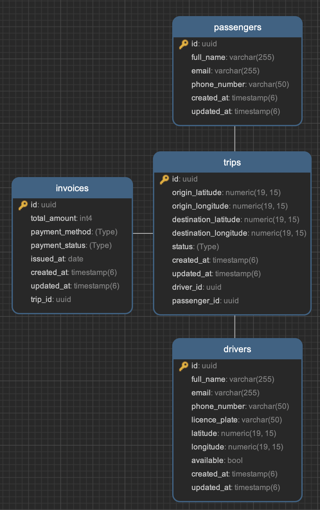

# Taxi 24

Este README describe cómo clonar, configurar, ejecutar y probar el proyecto Taxi24. El proyecto está desarrollado con las siguientes tecnologías:

- **NestJS:** Framework JavaScript para aplicaciones backend escalables.
- **TypeORM:** ORM para trabajar con bases de datos SQL desde TypeScript.
- **PostgreSQL:** Base de datos relacional.
- **Docker:** Plataforma para la virtualización de aplicaciones.
- **Docker Compose:** Herramienta para definir y ejecutar aplicaciones compuestas por varios contenedores.
- **Clean Architecture:** Un patrón de arquitectura de software que separa las responsabilidades del código en capas bien definidas. Esto hace que el código sea más modular, flexible y fácil de probar.

## 1. Ejecución

### 1.1 Requisitos previos

Antes de comenzar, asegúrese de tener al menos esos componentes en su estación de trabajo:

- [NodeJS](https://nodejs.org/) v16.x
- PostgreSQL
- Docker
- Docker Compose (Para utilizar el `docker-compose.yml` archivo proporcionado.)

### 1.2 Configuración

#### 1.2.1 Clonación del repositorio

Comience clonando este repositorio en su estación de trabajo

```sh
git clone https://github.com/lhachas/taxi24.git
```

#### 1.2.2 Configurar variables de entorno

- Crear un archivo `.env` en la raíz del proyecto.
- Copiar el contenido del archivo `.env.example` al nuevo archivo `.env.`
- Editar el archivo `.env` con la información de la base de datos y otras variables de configuración.

```env
# Application
API_PORT=3000

# Database
DB_HOST=localhost #De preferencia no modificar
DB_PORT=5432 #De preferencia no modificar
DB_USERNAME=test_user
DB_PASSWORD=test_psw
DB_DATABASE=taxi24_db

# Distance radius to search for drivers en KM
DRIVER_RADIUS_DISTANCE=3
```

> [!Nota]
> Para ejecutar el servicio, se sugiere emplear las mismas configuraciones predefinidas del archivo `.env.example` No es necesario realizar ajustes adicionales.

#### 1.2.3 Ejecución

Una vez que hayas configurado adecuadamente el archivo `.env` como se indicó anteriormente, puedes iniciar el servicio con `Docker Compose` utilizando el siguiente comando:

```sh
docker-compose up
```

Este comando desencadena una serie de acciones importantes internamente:

- **Creación de Contenedores:** Docker Compose crea y levanta los contenedores para la aplicación y la base de datos según lo especificado en el archivo docker-compose.yml.

- **Ejecución de Migraciones:** Una vez que los contenedores están en funcionamiento, la aplicación ejecuta automáticamente las migraciones de base de datos, asegurando que la estructura de la base de datos esté al día.

- **Carga de Datos Iniciales:** Además de las migraciones, se cargan automáticamente los datos iniciales necesarios para el funcionamiento adecuado de la aplicación. Esto puede incluir datos de prueba o semilla para garantizar una experiencia consistente durante el desarrollo y las pruebas.

> [!Nota]
> Para acceder al servicio <http://localhost:3000/api/>

## 2. Estructura de carpetas

```sh
src/
├── api/
│   ├── application/
│   │   ├── use-cases/      # Casos de uso de la aplicación
│   │   └── services/       # Servicios de la aplicación
│   ├── domain/             # Lógica de dominio de la aplicación
│   │   ├── models/         # Modelos de dominio
│   │   └── repositories/   # Repositorios de dominio
│   └── infrastructure/     # Infraestructura de la aplicación
│       ├── database/       # Configuración de base de datos
│       │   ├── data/       # Datos de prueba o semilla
│       │   ├── migrations/ # Migraciones de base de datos
│       │   └── repositories/ # Implementación de los repositorios
│       └── rest/           # Capa de presentación REST
│           └── controllers/ # Controladores REST
├── config/                 # Configuraciones generales de la aplicación
│   └── db.config.ts        # Configuración de la base de datos
├── shared/                 # Recursos compartidos
│   ├── enums/              # Enumeraciones compartidas
│   └── utils/              # Utilidades compartidas
└── main.ts                 # Punto de entrada principal de la aplicación
└── app.module.ts           # Módulo principal de la aplicación
```

## 3. Modelo de base de datos

<p align="center">
  
</p>

## 4. Ejecución de funcionalidades

Esta sección presenta los comandos curl para ejecutar todas las funcionalidades del API, con una cobertura total del 100% de los requisitos del proyecto. Estos comandos son universales, es decir, pueden ser utilizados en cualquier cliente HTTP, no solo en curl

### Documentación

Para facilitar la comprensión e integración del API, se ha desarrollado una documentación completa con Swagger. Esta documentación se encuentra disponible dentro del proyecto y ofrece una descripción detallada de cada endpoint, incluyendo sus parámetros, respuestas y ejemplos de uso.

```url
http://localhost:3000/api/docs
```

### Datos Iniciales

Para facilitar las pruebas y el desarrollo, la base de datos ya cuenta con datos precargados para `conductores` y `pasajeros`. Estos datos son esenciales para probar la funcionalidad de `viajes`.

### Facturación Automática

Se ha implementado la generación automática de una factura cada vez que se completa un viaje. El resultado de la factura se puede visualizar en el campo `invoice` del JSON de respuesta, proporcionando una mayor transparencia y control.

### Consideraciones Importantes

Se han tomado en cuenta y aplicado los consejos y sugerencias proporcionados durante el desarrollo del servicio, con el objetivo de optimizar la experiencia del usuario y la calidad del API.

### 4.1 Conductores

#### 4.1.1 Obtener una lista de todos los Conductores

```sh
curl -X GET \
  http://localhost:3000/api/drivers
```

```json
[
    {
        "id": "60397e16-a8f3-4714-90dc-af26bb9b0d25",
        "fullName": "Jennifer Arreola Angulo",
        "email": "Isabel63@gmail.com",
        "phoneNumber": "909186105",
        "licensePlate": "OC73QXT",
        "latitude": "-16.388021546929643",
        "longitude": "-71.572044537123530",
        "available": false,
        "createdAt": "2024-02-22T17:31:19.134Z",
        "updatedAt": "2024-02-22T17:31:19.134Z"
    },
    {
        "id": "714ed6f2-0a40-403d-937f-dc946bfcb035",
        "fullName": "Matilde Heredia Casares",
        "email": "Lorenzo98@hotmail.com",
        "phoneNumber": "992.593.851",
        "licensePlate": "PU43VWH",
        "latitude": "-16.414054109198110",
        "longitude": "-71.574215480330250",
        "available": true,
        "createdAt": "2024-02-22T17:31:19.134Z",
        "updatedAt": "2024-02-22T17:31:19.134Z"
    },
    # ... (otros conductores)
]
```

#### 4.1.2 Obtener una lista de todos los Conductores disponibles

```sh
curl -X GET \
  http://localhost:3000/api/drivers/availables
```

```json
[
    {
        "id": "714ed6f2-0a40-403d-937f-dc946bfcb035",
        "fullName": "Matilde Heredia Casares",
        "email": "Lorenzo98@hotmail.com",
        "phoneNumber": "992.593.851",
        "licensePlate": "PU43VWH",
        "latitude": "-16.414054109198110",
        "longitude": "-71.574215480330250",
        "available": true,
        "createdAt": "2024-02-22T20:56:23.862Z",
        "updatedAt": "2024-02-22T20:56:23.862Z"
    },
    {
        "id": "59bb3c7d-e438-40a1-bd31-a12d508cf511",
        "fullName": "Josep Aragón Cadena",
        "email": "Alejandro.PalomoBaca@gmail.com",
        "phoneNumber": "929 253 321",
        "licensePlate": "UU14YIX",
        "latitude": "-16.397497802548802",
        "longitude": "-71.580077026988420",
        "available": true,
        "createdAt": "2024-02-22T20:56:23.862Z",
        "updatedAt": "2024-02-22T20:56:23.862Z"
    },
    # ... (otros conductores)
]
```

#### 4.1.3 Obtener una lista de todos los Conductores disponibles en un radio de 3KM para una ubicación específica

```sh
curl -X GET \
  http://localhost:3000/api/drivers/nearby \
  -G \
  -d "latitude=-16.31161467716925" \
  -d "longitude=-71.53145554521213"
```

```json
[
    {
        "id": "4cb97968-06fc-4606-a139-2ebaf4368148",
        "fullName": "Laura Rascón Pizarro",
        "email": "Rafael43@yahoo.com",
        "phoneNumber": "906725817",
        "licensePlate": "CX03FGE",
        "latitude": "-16.335529330010430",
        "longitude": "-71.555653915912760",
        "available": true,
        "createdAt": "2024-02-22T17:31:19.134Z",
        "updatedAt": "2024-02-22T17:31:19.134Z"
    }
]
```

#### 4.1.4 Para un pasajero solicitando un viaje, Obtenga una lista de los 3 conductores más cercanos al punto de partida

```sh
curl -X GET \
  http://localhost:3000/api/drivers/nearest \
  -G \
  -d "latitude=-16.322988255711252" \
  -d "longitude=-71.54650071278732"
```

```json
[
    {
        "id": "4cb97968-06fc-4606-a139-2ebaf4368148",
        "fullName": "Laura Rascón Pizarro",
        "email": "Rafael43@yahoo.com",
        "phoneNumber": "906725817",
        "licensePlate": "CX03FGE",
        "latitude": "-16.335529330010430",
        "longitude": "-71.555653915912760",
        "available": true,
        "createdAt": "2024-02-22T17:31:19.134Z",
        "updatedAt": "2024-02-22T17:31:19.134Z"
    },
    {
        "id": "2bc2e877-604c-4274-8249-dd31bfa77639",
        "fullName": "Andrea Caraballo Maya",
        "email": "Antonia93@hotmail.com",
        "phoneNumber": "973.458.079",
        "licensePlate": "UW25HQG",
        "latitude": "-16.346466372556712",
        "longitude": "-71.552506048263010",
        "available": false,
        "createdAt": "2024-02-22T17:31:19.134Z",
        "updatedAt": "2024-02-22T17:31:19.134Z"
    },
    {
        "id": "aee458e6-c2bf-417b-a696-5a1e19dbd9a2",
        "fullName": "Laura Ibarra Fajardo",
        "email": "Sonia.VieraMota42@hotmail.com",
        "phoneNumber": "954 095 019",
        "licensePlate": "XC45TQE",
        "latitude": "-16.325425042156564",
        "longitude": "-71.581922328714130",
        "available": true,
        "createdAt": "2024-02-22T17:31:19.134Z",
        "updatedAt": "2024-02-22T17:31:19.134Z"
    }
]
```

#### 4.1.5 Obtener un conductor específico por ID

```sh
curl -X GET \
  http://localhost:3000/api/drivers/60397e16-a8f3-4714-90dc-af26bb9b0d25
```

```json
{
    "id": "60397e16-a8f3-4714-90dc-af26bb9b0d25",
    "fullName": "Jennifer Arreola Angulo",
    "email": "Isabel63@gmail.com",
    "phoneNumber": "909186105",
    "licensePlate": "OC73QXT",
    "latitude": "-16.388021546929643",
    "longitude": "-71.572044537123530",
    "available": false,
    "createdAt": "2024-02-22T20:56:23.862Z",
    "updatedAt": "2024-02-22T20:56:23.862Z"
}
```

### 4.2 Pasajeros

#### 4.2.1 Obtener una lista de todos los pasajeros

```sh
curl -X GET \
  http://localhost:3000/api/passengers
```

```json
[
    {
        "id": "51d0776f-2d94-4c7f-8335-ddf2035ca68d",
        "fullName": "Laura Benavídez Bueno",
        "email": "Agustin_PantojaDelatorre@yahoo.com",
        "phoneNumber": "952678208",
        "createdAt": "2024-02-22T20:56:23.862Z",
        "updatedAt": "2024-02-22T20:56:23.862Z"
    },
    {
        "id": "ec880a6b-0321-4148-88f0-a3e9df79d3d5",
        "fullName": "Juan Ramón Nava Delrío",
        "email": "Monica.LozanoCardenas11@hotmail.com",
        "phoneNumber": "990468148",
        "createdAt": "2024-02-22T20:56:23.862Z",
        "updatedAt": "2024-02-22T20:56:23.862Z"
    },
    # ... (otros conductores)
]
```

#### 4.2.2 Obtener un pasajero especifico por su ID

```sh
curl -X GET \
  http://localhost:3000/api/passengers/51d0776f-2d94-4c7f-8335-ddf2035ca68d
```

```json
{
    "id": "51d0776f-2d94-4c7f-8335-ddf2035ca68d",
    "fullName": "Laura Benavídez Bueno",
    "email": "Agustin_PantojaDelatorre@yahoo.com",
    "phoneNumber": "952678208",
    "createdAt": "2024-02-22T20:56:23.862Z",
    "updatedAt": "2024-02-22T20:56:23.862Z"
}
```

### 4.3 Viajes

#### 4.3.1 Crear una nueva solicitud de "Viaje" asignando un conductor a un pasajero

Para iniciar una solicitud de viaje y asignar un conductor a un pasajero, se requieren los IDs correspondientes del conductor y del pasajero. Estos IDs deben estar disponibles previamente, ya que se crean al inicio del servicio.

Para obtener los IDs necesarios, utilice los endpoints previamente definidos para listar los conductores y pasajeros. A partir de esta información, puede extraer los IDs requeridos para completar esta funcionalidad.

```sh
curl -X POST \
  http://localhost:3000/api/trips \
  -H "Content-Type: application/json" \
  -d '{
    "driverId": "714ed6f2-0a40-403d-937f-dc946bfcb035",
    "passengerId": "51d0776f-2d94-4c7f-8335-ddf2035ca68d",
    "originLatitude": -16.357923569913446,
    "originLongitude": -71.56444623590001,
    "destinationLatitude": -16.42519498149658,
    "destinationLongitude": -71.5174453154744,
    "status": "in_progress"
  }'
```

```json
{
    "driver": {
        "id": "714ed6f2-0a40-403d-937f-dc946bfcb035",
        "fullName": "Matilde Heredia Casares",
        "email": "Lorenzo98@hotmail.com",
        "phoneNumber": "992.593.851",
        "licensePlate": "PU43VWH",
        "latitude": "-16.414054109198110",
        "longitude": "-71.574215480330250",
        "available": true,
        "createdAt": "2024-02-22T20:56:23.862Z",
        "updatedAt": "2024-02-22T20:56:23.862Z"
    },
    "passenger": {
        "id": "51d0776f-2d94-4c7f-8335-ddf2035ca68d",
        "fullName": "Laura Benavídez Bueno",
        "email": "Agustin_PantojaDelatorre@yahoo.com",
        "phoneNumber": "952678208",
        "createdAt": "2024-02-22T20:56:23.862Z",
        "updatedAt": "2024-02-22T20:56:23.862Z"
    },
    "originLatitude": -16.357923569913446,
    "originLongitude": -71.56444623590001,
    "destinationLatitude": -16.42519498149658,
    "destinationLongitude": -71.5174453154744,
    "status": "in_progress",
    "id": "37cca3d5-647c-46d0-817d-802d99c6f9cd",
    "createdAt": "2024-02-22T22:32:45.117Z",
    "updatedAt": "2024-02-22T22:32:45.117Z"
}
```

#### 4.3.2 Obtener una lista de todos los viajes activos

```sh
curl -X GET \
  http://localhost:3000/api/trips/actives
```

```json
[
    {
        "id": "37cca3d5-647c-46d0-817d-802d99c6f9cd",
        "originLatitude": "-16.357923569913446",
        "originLongitude": "-71.564446235900010",
        "destinationLatitude": "-16.425194981496580",
        "destinationLongitude": "-71.517445315474400",
        "status": "in_progress",
        "createdAt": "2024-02-22T22:32:45.117Z",
        "updatedAt": "2024-02-22T22:32:45.117Z",
        "driver": {
            "id": "3a593700-fed9-4434-9b45-289c3b7efd8d",
            "fullName": "Matilde Heredia Casares",
            "email": "Lorenzo98@hotmail.com",
            "phoneNumber": "992.593.851",
            "licensePlate": "PU43VWH",
            "latitude": "-16.414054109198110",
            "longitude": "-71.574215480330250",
            "available": true,
            "createdAt": "2024-02-22T20:56:23.862Z",
            "updatedAt": "2024-02-22T20:56:23.862Z"
        },
        "passenger": {
            "id": "ae707f47-b4b1-4874-bc52-30574632b731",
            "fullName": "Laura Benavídez Bueno",
            "email": "Agustin_PantojaDelatorre@yahoo.com",
            "phoneNumber": "952678208",
            "createdAt": "2024-02-22T20:56:23.862Z",
            "updatedAt": "2024-02-22T20:56:23.862Z"
        },
        "invoice": null
    }
]
```

#### 4.3.3 Completar un viaje

Para completar un viaje, debe utilizar el ID del viaje creado previamente.

Una vez completado el viaje, se generará automáticamente una factura internamente. Puede verificar la creación de la factura observando el campo **"invoice"** en el JSON resultante.

```sh
curl -X PUT \
  http://localhost:3000/api/trips/37cca3d5-647c-46d0-817d-802d99c6f9cd
```

```json
{
    "id": "37cca3d5-647c-46d0-817d-802d99c6f9cd",
    "originLatitude": "-16.357923569913446",
    "originLongitude": "-71.564446235900010",
    "destinationLatitude": "-16.425194981496580",
    "destinationLongitude": "-71.517445315474400",
    "status": "completed",
    "createdAt": "2024-02-22T22:32:45.117Z",
    "updatedAt": "2024-02-22T22:37:59.388Z",
    "driver": {
        "id": "714ed6f2-0a40-403d-937f-dc946bfcb035",
        "fullName": "Matilde Heredia Casares",
        "email": "Lorenzo98@hotmail.com",
        "phoneNumber": "992.593.851",
        "licensePlate": "PU43VWH",
        "latitude": "-16.414054109198110",
        "longitude": "-71.574215480330250",
        "available": true,
        "createdAt": "2024-02-22T20:56:23.862Z",
        "updatedAt": "2024-02-22T20:56:23.862Z"
    },
    "passenger": {
        "id": "51d0776f-2d94-4c7f-8335-ddf2035ca68d",
        "fullName": "Laura Benavídez Bueno",
        "email": "Agustin_PantojaDelatorre@yahoo.com",
        "phoneNumber": "952678208",
        "createdAt": "2024-02-22T20:56:23.862Z",
        "updatedAt": "2024-02-22T20:56:23.862Z"
    },
    "invoice": {
        "id": "5b47dd47-edab-4650-89c1-dd99762c516c",
        "totalAmount": 120,
        "paymentMethod": "cash",
        "paymentStatus": "paid",
        "issuedAt": "2024-02-22T22:37:59.394Z",
        "createdAt": "2024-02-22T22:37:59.394Z",
        "updatedAt": "2024-02-22T22:37:59.394Z"
    }
}
```
